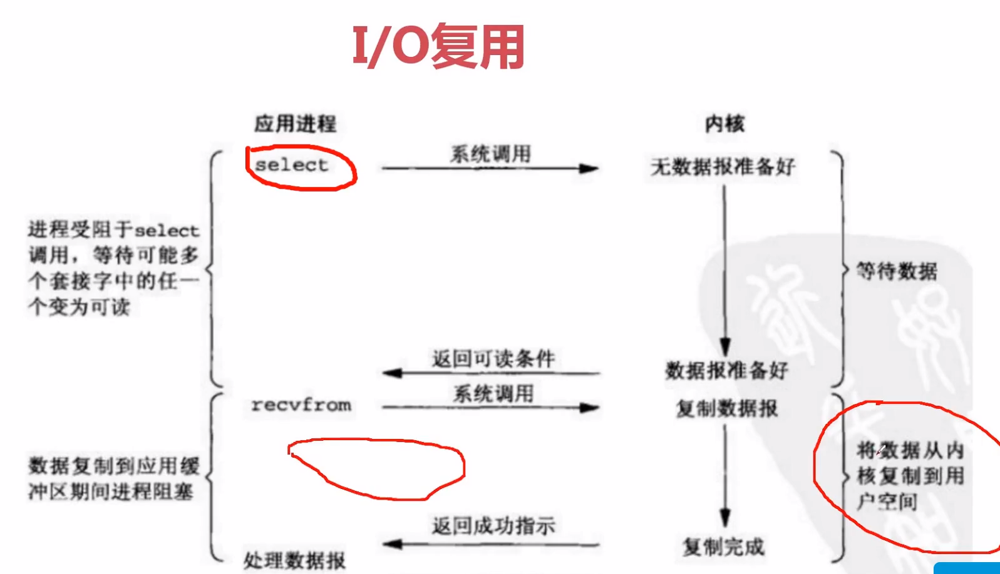
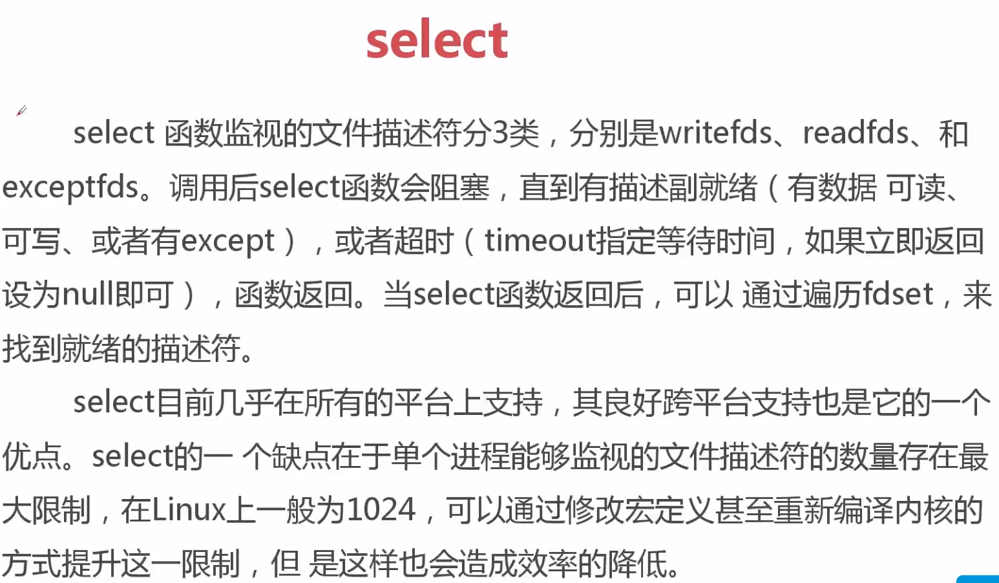
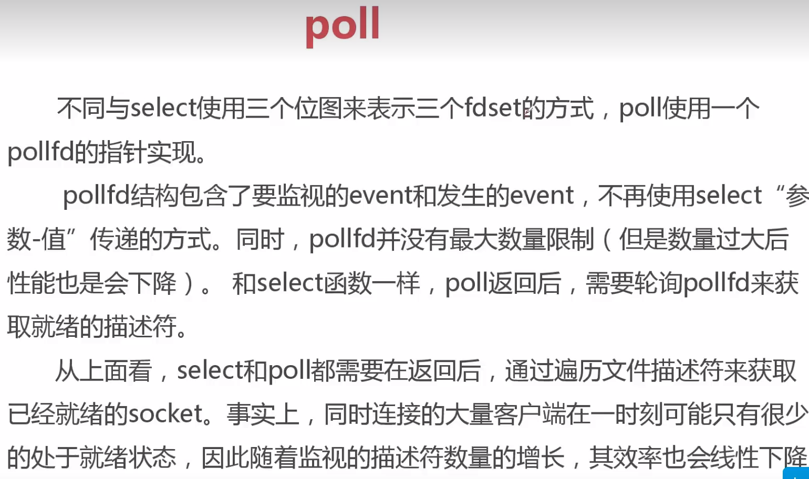
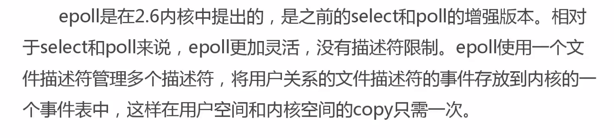
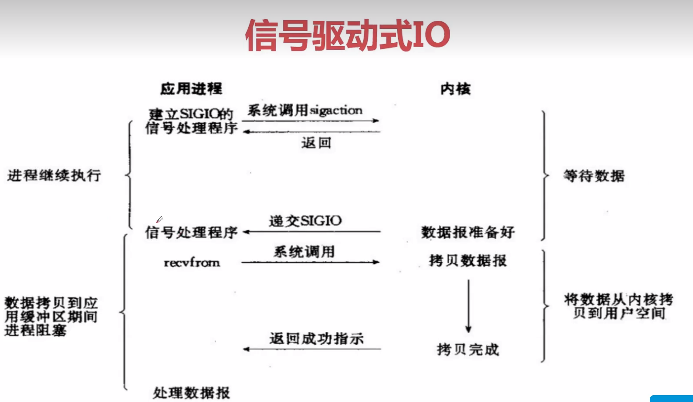
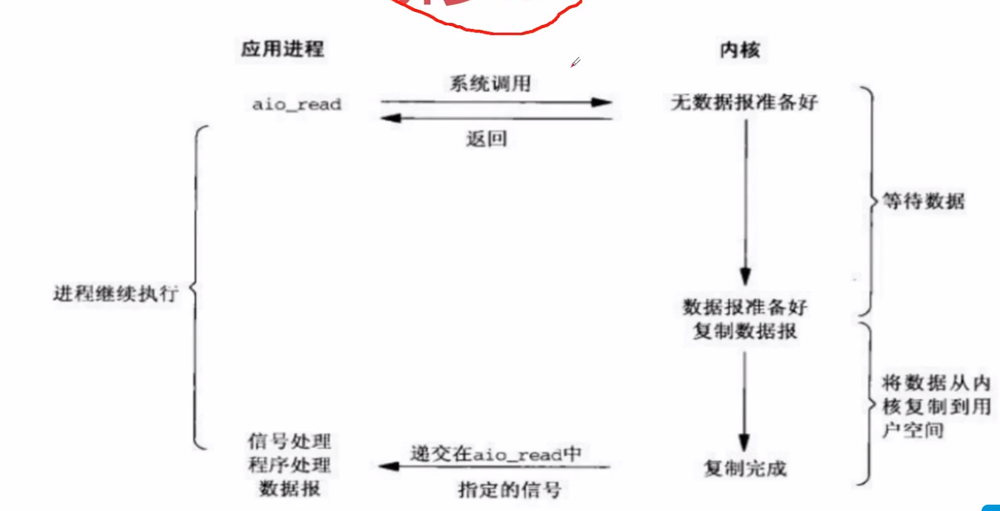

# io复用

## select

select 函数监视的文件描述符分3类，分别是writefds、readfds、和

exceptfds。调用后select函数会阻塞，直到有描述副就绪（有数据可读、

可写、或者有except），或者超时（timeout指定等待时间，如果立即返回

设为null即可），函数返回。当select函数返回后，可以通过遍历fdset，来

找到就绪的描述符。

select目前几乎在所有的平台上支持，其良好跨平台支持也是它的一个

优点。select的一个缺点在于单个进程能够监视的文件描述符的数量存在最

大限制，在Linux上一般为1024，可以通过修改宏定义甚至重新编译内核的

方式提升这一限制，但是这样也会造成效率的降低。

## poll

poll

不同与select使用三个位图来表示三个fdset的方式，poll使用一个

pollfd的指针实现。

pollfd结构包含了要监视的event和发生的event，不再使用select“参

数-值”传递的方式。同时，pollfd并没有最大数量限制（但是数量过大后

性能也是会下降）。和select函数一样，pol返回后，需要轮询pollfd来获

取就绪的描述符。

从上面看，select和pol都需要在返回后，通过遍历文件描述符来获取

已经就绪的socket。事实上，同时连接的大量客户端在一时刻可能只有很少

的处于就绪状态，因此随着监视的描述符数量的增长，其效率也会线性下降

## epoll

epol是在2.6内核中提出的，是之前的select和pol的增强版本。相对

于select和poll来说，epoll更加灵活，没有描述符限制。epol使用一个文

件描述符管理多个描述符，将用户关系的文件描述符的事件存放到内核的一

个事件表中，这样在用户空间和内核空间的copy只需一次。

# 信号式io

# 异步io

