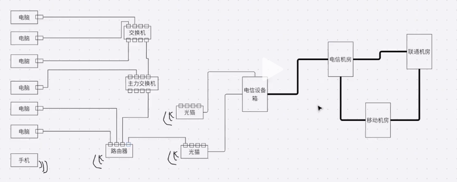

示意图



# 五层网络模型


# socket编程

scoket 不属于网络协议

用于连接应用和tcp层的一个接口，可以让应用和tcp打交道


## 服务断

```python
import socket
import threading

# 生成服务器
server = socket.socket(socket.AF_INET, socket.SOCK_STREAM)
# 监听绑定
server.bind(('0.0.0.0', 18888))
# 等待客户端连接
server.listen()


def handle_sock(sock, addr):
    # 获取从客户端发送的数据
    data = sock.recv(1024)
    # 将获得的数据解码
    print(data.decode('utf-8'))
    # 发送消息给客户端,数据encode加码
    ser_data = input('>>>>')
    sock.send('Server:{}'.format(ser_data).encode('utf-8'))


while True:
    # 接收用户连接请求，获得socker和address
    sock, addr = server.accept()
    # 实现多用户连接
    client_thread = threading.Thread(target=handle_sock, args=(sock, addr))
    client_thread.start()

```

## 客户端

```python
import socket
# 生成客户端
client = socket.socket(socket.AF_INET, socket.SOCK_STREAM)
# 连接服务器
client.connect(('127.0.0.1', 18888))
# 给服务器发送数据
while True:
    cil_data = ''
    if cil_data != '0':
        cil_data = input('>>>>')
        client.send('Client:{}'.format(cil_data).encode('utf-8'))
        data = client.recv(1024)
        print(data.decode('utf-8'))
    else:
        client.close()
        break
    # client.close()

```

## socket 模拟http请求

```python
import socket
from urllib.parse import urlparse


def get_url(url):
    # 解析url
    url = urlparse(url)
    # 获得主域名
    host = url.netloc
    # 获得子路经
    path = url.path
    if path == '':
        path = '/'
    # 建立socket连接
    client = socket.socket(socket.AF_INET, socket.SOCK_STREAM)
    client.connect((host, 80))
    # 发送请求
    client.send('GET {} HTTP/1.1\r\nHost:{}\r\nConnection:close\r\n\r\n'.format(path, host).encode('utf8'))
    data = b''
    while True:
        d = client.recv(1024)
        if d:
            data += d
        else:
            break
    data = data.decode('utf-8')
    # 去除头部信息
    # data = data.split('\r\n\r\n')[1]
    print(data)
    client.close()


if __name__ == '__main__':
    get_url('http://www.baidu.com')

```

